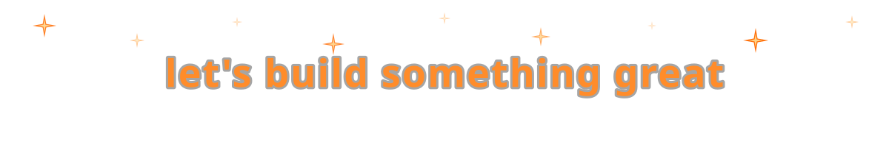

<!-- SECTION: Hero -->
# Stanislav Hohulia — Fullstack Engineer

### Node.js · Vue.js · AWS

2+ years of commercial experience in product teams and freelance. Worked at Dnipro-M — a product with 3.7M+ monthly visitors across 10+ countries. Delivered 5+ freelance projects end-to-end, from MVPs to performance-critical systems.

**Selected results:** 
▸ +43% Core Web Vitals — initiated and led architecture refactoring + Webpack optimization 
▸ 800ms → 120ms API response — independently identified the bottleneck, resolved with Redis caching

📍 Kyiv, Ukraine &nbsp;·&nbsp; 🇬🇧 English B2 &nbsp;·&nbsp; ✅ Open to work

<!-- SECTION: Tech Stack -->
## 🛠 Tech Stack

**Backend**

**Frontend**

**Testing**

**Tools & Practices**

**Principles**

<!-- SECTION: Projects — fill in name, links, and description for each -->
## 🚀 Selected Projects

**[Project Name]**
One sentence describing what it does and what problem it solves.
`Node.js` · `NestJS` · `TypeScript` · `Redis`
[Repo](repo-link) · [Live Demo](live-demo-link)

**[Project Name]**
One sentence describing what it does and what problem it solves.
`Vue.js` · `React` · `TypeScript` · `AWS`
[Repo](repo-link) · [Live Demo](live-demo-link)

**[Project Name]**
One sentence describing what it does and what problem it solves.
`Node.js` · `Vue.js` · `Docker` · `Webpack`
[Repo](repo-link) · [Live Demo](live-demo-link)

<!-- SECTION: GitHub Stats -->
## ⚙️ &nbsp;GitHub Analytics

  

  

<!-- SECTION: Contact -->
## 📬 Let's Talk

---

## Background Effect Preview

